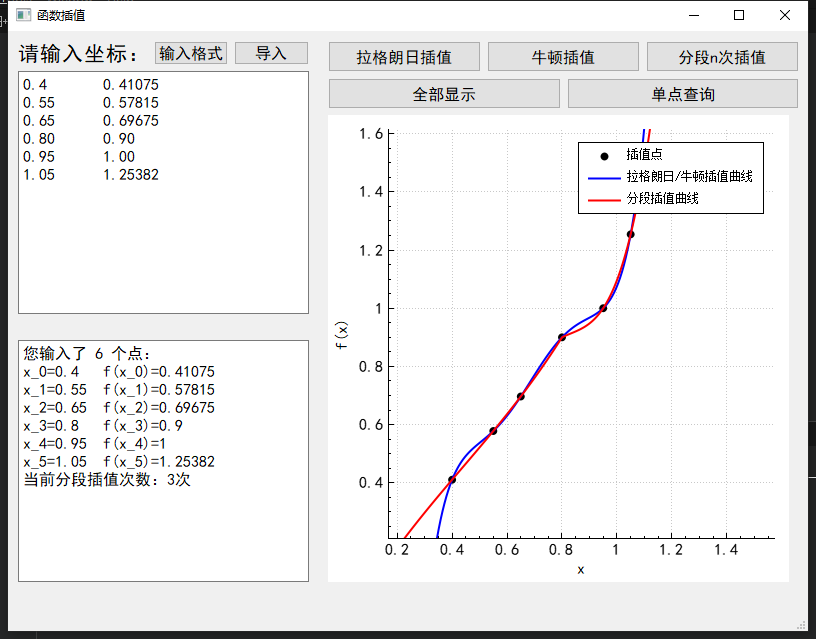

## **华东师范大学计算机科学与技术系上机实践报告**

| 课程名称：数值计算         | 年级：18级        | 上机实践成绩：      |
| -------------------------- | ----------------- | ------------------- |
| 指导教师：谢瑾奎           | 姓名：汪杰        | 上机实践日期：10/19 |
| 上机实践名称：函数插值方法 | 学号：10185102223 | 上机实践编号：No.1  |

------

### 一、实验目的

- 学会常用的插值方法，求函数的近似表达式，以解决其它实际问题
- 明确插值多项式和分段插值多项式各自的优缺点
- 熟悉插值方法的程序编制
- 如果绘出插值函数的曲线，观察其光滑性

### 二、使用环境

QT 5.15.1，32位编译器

### 三、内容与设计思想

#### 3.1 拉格朗日插值

公式如下
$$
L_{n}(x)=\sum_{k=0}^{n}\left(\prod_{i=0 \atop i \neq k}^{n} \frac{x-x_{i}}{x_{k}-x_{i}}\right) y_{k}
$$
直接按照公式实现代码（参考实验指导书），计算每个 $x$ 的复杂度为 $O(n^2)$ 。

由于拉格朗日法没有扩展性，无法复用数据。没有优化空间。

#### 3.2 牛顿插值

公式如下
$$
N_{n}(x)=f\left(x_{0}\right)+\sum_{k=1}^{n} f\left[x_{0}, \cdots x_{k}\right] \bullet \prod_{j=0 \atop j \neq k}^{k-1}\left(x-x_{j}\right)\\
f\left[x_{0}, \cdots, x_{k}\right]=\sum_{i=0}^{k} \frac{f\left(x_{i}\right)}{\prod_{j=0 \atop j \neq i}^{k}\left(x_{i}-x_{j}\right)}
$$
若按照上式直接实现，计算每个 $x$ 的复杂度高达 $O(n^3)$ ，其中：

- 计算差分 $f\left[x_{0}, \cdots x_{k}\right]$ 需要 $O(n^2)$ 
- 计算连乘 $\prod_{j=0 \atop j \neq k}^{k-1}\left(x-x_{j}\right)$ 需要 $O(n)$ 
- 外层循环 $k$ ，最终复杂度 $O(n\cdot(n^2+n))=O(n^3)$ 

实际上，上述复杂度可以大幅优化：

- 当插值点 $P_0,P_1,P_2,\dots$ 确定后，差分表就确定了，不需要重复计算。考虑到画图时需要对不同的 $x$ 反复使用差分表，若用 $O(n)$ 的空间复杂度存储差分表，即可将计算差分的时间复杂度优化为 $O(1)$ 的查表。（当然，如果只要查询一个 $x$ 的插值结果，则不需要这个优化）。于是时间复杂度变为 $O(n\cdot(1+n))=O(n^2)$ 
- 由于连乘的顺序与外层循环顺序相同，可以存储上一次循环时连乘的结果，下一次循环新添加一项即可（仿照秦九昭算法）。最终时间复杂度变为 $O(n\cdot(1+1))=O(n)$ 

下面考虑如何初始化差分表：

- 实验指导书中的实现比较高级，化简了差分表达式，不借助额外空间，直接计算出 $k$ 阶差分，时间复杂度 $O(n^2)$ ，空间复杂度 $O(1)$ 。但是这个算法不宜用来初始化差分表，因为需要计算 $n$ 个差分，时间复杂度 $O(n^3)$ 
- 考虑直接打表，差分表需要占用 $O(n^2)$ 的空间，相应地时间复杂度也是 $O(n^2)$ 
- 在此基础上可以进一步把空间复杂度压缩到 $O(n)$ 。只要存储所有的 $k$ 阶差分，每轮循环把数组更新为 $k+1$ 阶差分。时间复杂度不变。

不过，上述初始化差分表的优化在本实验中的重要性并不显著，在实际应用中也不太重要。

- 在实际应用中，插值点一般不能太多（龙格现象）。通常，插值函数只在 $n\le 8$ 时是稳定的。
- 在本实验中，需要绘制插值函数图像，且绘图消耗的时间远大于初始化差分表的时间。
- 上述优化只在极其特殊的情况下有效，例如已知目标函数是 $n$ 次多项式函数（ $n$ 已知，屏蔽龙格现象），且插值点很多。

#### 3.3 分段插值

由于龙格现象的存在，插值次数不宜过高，于是主动降低插值次数。

例如在 $P_0,P_1,P_2,\dots$ 这些点上做三次插值，就选择 $[P_0,P_1,P_2,P_3],[P_3,P_4,P_5,P_6],\dots$ 做三次插值，分别对应区间 $[-\infty,x_3],[x_3,x_6],\dots$ 

该方法中有一些细节是未定义的，实现时可以自己定义：

- 插值方法选择？
  - 根据相关理论，拉格朗日插值与牛顿插值得到的结果是相同的。
  - 本实验选择牛顿法，因为绘图复杂度相较于拉格朗日法较低。
- 当点数不能恰好分配完时，如何处理余下的点？
  - 本实验中，复用倒数第二个区间的若干个点，让最后一个区间凑足点数。
  - 例如对9个点做三次插值，本实验中复用 $P_5,P_6$ ： $\dots,[P_3,P_4,P_5,P_6],[P_5,P_6,P_7,P_8]$ ，分别对应区间 $\dots,[x_3,x_6],[x_6,+\infty]$ 

分段插值复杂度：

- 共有 $O(\frac n k)$ 个分段，初始化所有差分表 $O(\frac n k\cdot k^2)=O(nk)$ 。
- 单点查询需要从所有分段中二分查找 $x$ 所在的段，时间复杂度 $O(n+\log\frac n k)=O(n)$ 

#### 3.4 绘图算法

完成插值算法后，还需要考虑如何将插值函数呈现在屏幕上。

计算机绘制函数图像的过程十分简单粗暴：描点连线。

绘图复杂度计算：

- 设取样点个数为 $m$ 。显然，要使图像较为光滑，需要大量的点，即 $m\gg n$ 。
- 若采用拉格朗日法，需要 $O(n^2)$ 计算每个插值点，不需要初始化。最终复杂度 $O(n^2m)$
- 若采用牛顿法，需要 $O(n^2)$ 初始化差分表，需要 $O(n)$ 计算每个插值点。最终复杂度为 $O(nm+n^2)=O(nm)$ 
- 牛顿法更优，故选择此法绘图。
  - 分段插值用牛顿法实现。
  - 出于效率考虑，即使选择显示拉格朗日插值曲线，内部也用牛顿法绘制（结果一样）。
  - 只在单点查询时使用拉格朗日插值。（用以验证插值代码的正确性）

#### 3.5 动态绘图

为了更好地展示插值函数，需要在插值点变化时，动态地改变坐标系显示范围置。

- 用户导入数据后，根据各个插值点，选择一个窗口位置，使得所有点均匀分布在屏幕中央。

另一方面，插值函数可以扩展到整个实数域，不应该局限在某一范围内。提供一个交互方式，使用户能更加全面地查看函数图像。

- 本实验的绘图工具是QT的QCustomPlot，这是一个第三方库，对QT原生的绘图功能进行了封装。基于这个第三方库，可以方便地打开用户交互接口，用户可以通过鼠标拖动和滚轮来操控坐标系显示范围。

- 随着用户交互地改变坐标系显示范围，显示的图像也需要改变。但是不能一开始就计算好，因为这样就有无穷多的点需要计算。即使选择一个充分大的范围，也会导致放大后不够平滑（产生肉眼可见的折线）。
  - 该方案中，在计算能力一定的情况下，平滑程度与数据范围是互相对立的。
- 本实验根据当前坐标系显示范围，计算出该范围内的点并连线。每当用户改变坐标系显示范围，就需要重新计算视角内的函数图像。
  - 由于平滑程度是由点的密度决定的，而不是点与点之间的坐标距离。所以不论显示坐标的范围是多少，只要绘图点的个数足够，就能足够平滑。
- 该方案牺牲了用户移动坐标系时的效率，但是能以任意精度显示任意范围内的函数图像。最后，本实验选择在屏幕中按 $x$ 轴均匀绘制 $200$ 个点，以均衡交互效率与平滑程度。
  - 该方案中，在计算能力一定的情况下，平滑程度与交互性能是互相对立的。

#### 3.6 输入输出方案

虽然QT提供了方便的浮点数输入框，但是为了便于用户输入和修改所有的插值点，需要提供输入缓冲区。

- 用多行文本编辑器输入，而不是只能输入一个浮点数的输入框。
- 需要一定的字符串处理。好在QT的 **QString** 类封装了不少有用的函数
  -  **QString** 类是对STL中的 **string** 类的封装
  - 从多行文本编辑器中按行读取字符串
  -  **QString::simplified()** 可以处理多余的空格
  -  **QString::section()** 可以指定分隔符，并取出分隔符分隔的字段。
  -  **QString::toDouble()** 将浮点数字符串转换为 **double** 类型。

提供确认信息，让用户知晓输入成功。

-  **QString::arg()** 类似于 **printf()** ，方便格式化输出。

单点查询采用消息框进行输入输出。

#### 3.7 源文件结构

实现算法与UI界面的分离：

-  <u>interpolate.[ch]</u> 实现插值算法，并提供接口。
- QT的工程文件自带了若干个源文件，主要实现UI界面和输入输出，利用 <u>interpolate.h</u> 提供的接口执行插值算法。

### 四、实验结果

#### 4.1 运行截图

#### 4.2 可执行文件打包

为了防止环境问题导致无法运行，本实验提交时附带了所需的相关库，直接运行 <u>run/lab1.exe</u> 即可。

- 生成release版本的可执行文件。
- 将可执行文件 lab1.exe 复制到新的目录下，这里是 <u>run/</u> 
- 利用QT自带的 windeployqt 工具配置相关库文件

### 五、总结

- 由于是第一次实验，还需要学习QT的使用，总体上我认为UI界面的制作比插值算法的实现要难。
- 尽可能地优化了插值算法的时间和空间复杂度。
- 从分段插值的结果上可以看到，两段的交界处，导数是不连续的（显然，由于插值点不同）。如何使分界点更平滑？
- UI界面上有进一步优化的空间：目前不支持适应窗口大小，若UI界面能随窗口大小变化而自动变化，就能适应更多的应用场景（例如在大显示器上显示更大的绘图区域）。

### 六、附录

代码见工程文件