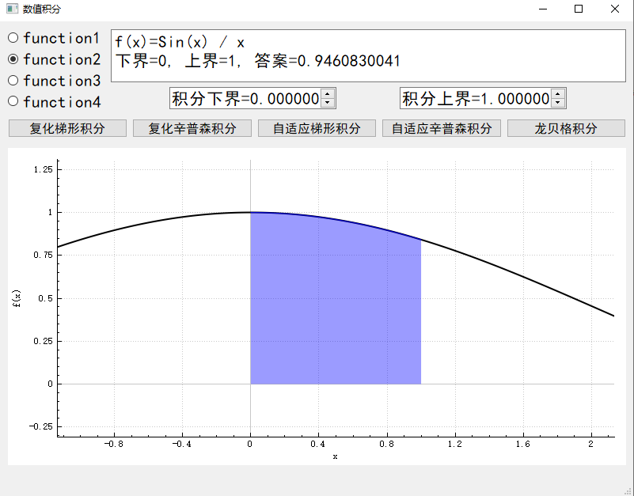
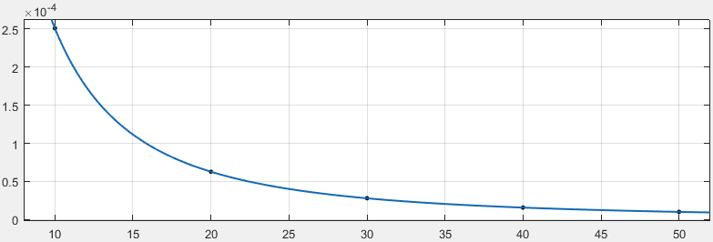
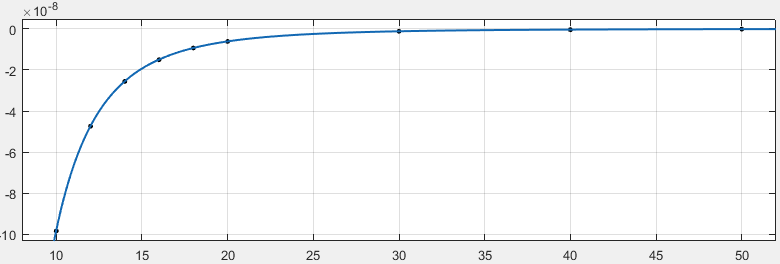

# 华东师范大学计算机科学与技术系上机实践报告

| 课程名称：数值计算     | 年级：18级        | 上机实践成绩：      |
| ---------------------- | ----------------- | ------------------- |
| 指导教师：谢瑾奎       | 姓名：汪杰        | 上机实践日期：10/29 |
| 上机实践名称：数值积分 | 学号：10185102223 | 上机实践编号：No.3  |

------

### 一、实验目的

- 深刻认识数值积分法的意义
- 明确数值积分精度与步长的关系
- 熟悉定积分方法的程序编制
- 根据定积分的计算方法，可以考虑二重积分的计算问题


### 二、使用环境

- C++
- QT 5.15.1
- 32位编译器


### 三、内容与设计思想

#### 3.1 复化梯形积分

$$
T(h) =T_{n}(f)=h\left[\frac{1}{2} f(a)+\sum_{i=1}^{n-1} f\left(x_{i}\right)+\frac{1}{2} f(b)\right]\\
E_n(f)=-\dfrac{(b-a)^3}{12n^2}f''(\xi),\quad a\le \xi\le b
$$


#### 3.2 复化辛普森积分

$$
S_{n}(f)=\frac{h}{3}\left[f(a)+4 \sum_{i=0}^{m-1} f\left(x_{2 i+1}\right)+2 \sum_{i=1}^{m-1} f\left(x_{2 i}\right)+f(b)\right]\\
E_n(f)=-\dfrac{(b-a)^4}{180n^4}f^{(4)}(\xi),\quad a\le \xi\le b
$$
其中， $n=2m$ ，故 $n$ 必须是偶数。

上述两种复化积分的复杂度都是 $O(n)$ 。


#### 3.3 自动控制误差的复化积分

根据书本 $\S6.2.3$ ，可以动态地选择分点数 $n$ ，使误差不超过给定的 $\varepsilon$ 。

具体来说：设 $I_n(f),I_{2n}(f)$ 分别表示分点数为 $n,2n$ 时的复化积分结果，当 $|I_n(f)-I_{2n}(f)|>\varepsilon$ 时，令 $n$ 翻倍。直到两次复化积分的差不超过给定误差限时，输出结果。

由于前面已经封装了计算简单复化积分的函数，实现自适应复化积分时可以直接调用。

自适应算法的复杂度：

- 书中给出的伪代码是包含优化的，优化思想如下：
  - 每次计算复化积分需要计算若干个分点上的函数值
  -  $n$ 翻倍后，原有的分点不需要重复计算，只需要计算新的分点。
  - 在所有点都只计算一次的情况下，自适应算法的复杂度显然是 $O(n)$ 
    - 其中，分点数 $n$ 是随精度要求（和被积函数）变化的。
- 若采用上述计算方式，就不能复用已有函数。
- 下面分析：若每次都重新计算所有分点的复杂度（即调用已有函数）。
  - 假设初始分点数为 $1$ ，最终分点数 $n=2^k$ （实际的实现中，初始分点数为 $10$ ，以防假收敛）
  - 函数值的计算次数为 $1+2+4+\cdots+2^k=2^{k+1}-1\approx2n$ 
  -  复杂度依然是 $O(n)$ ，只是多了一个常数 $2$ 。
- 可见，即使不优化，复杂度也可以接受，而带来的好处是代码复用率提升、代码复杂度下降。所以本实验的实现中没有加入上述优化。

#### 3.4 龙贝格积分

$$
\begin{cases}
R_{k, 1}=T_{n\cdot2^{k-1}}(f)\\
R_{k, j}=R_{k, j-1}+\dfrac{R_{k, j-1}-R_{k-1, j-1}}{4^{j-1}-1}, \quad k=2,3, \cdots
\end{cases}
$$

阅读了实验指导书中给出的龙贝格算法后，我认为这个实现只计算了表格的第一列，与书中表述的龙贝格算法不一致。所以需要自己填补剩下的表格。

此外，表格第一列 $R_{k,1}$ 是复化梯形积分，可以调用已有函数，不需要写额外代码计算，且相较于书中带有优化的算法，时间复杂度不变（理由同3.3）

空间复杂度优化：

- 朴素实现龙贝格算法需要 $O(m^2)$ 的空间复杂度，其中 $m$ 是循环次数。
- 通过滚动数组的方式，可以压缩到 $O(m)$ 。
- 本实验中用了两个数组，交替存储，变量 `cur` 记录当前数组下标。
- 虽然可以只用一个数组，但是这种方式实现起来不够优雅。

参考下面的代码，分析时间复杂度：

- 注：程序员数数从 $0$ 开始，所以表格下标从 $R_{0,0}$ 开始。
- 假设最大分点数为 $n$ 。
-  `T_n` 是计算复化梯形积分的函数，分点数为  `1 << k` ，即 $2^k$ 。由于是成倍增长，总分点数为 $O(n)$ 。
  - 即计算表格第一列的复杂度为 $O(n)$
- 除去代码第2行的复化梯形积分，内循环执行 $k$ 次，外循环执行 $\log_2n$ 次，复杂度为 $O(\log^2n)$ 
  - 即计算剩余表格（除去第一列）的复杂度为 $O(\log^2n)$ 
- 总复杂度 $O(n+\log^2n)=O(n)$ 。
- 龙贝格积分也是一种自适应积分，分点数 $n$ 是随精度要求（和被积函数）变化的。

```c++
for (k = 1, cur = 1; k < maxk; ++k, cur = !cur) {
    arr[0][cur] = T_n(func, a, b, 1 << k);
    double pow_4 = 4;
    for (int j = 1; j <= k; ++j, pow_4 *= 4)
        arr[j][cur] = arr[j-1][cur] + (arr[j-1][cur] - arr[j-1][!cur]) / (pow_4-1);
    if (qAbs(arr[k][cur] - arr[k - 1][!cur]) < eps) break;
}
```

最后要指出，在上面分析时间复杂度时，都默认单个函数值的计算代价为 $O(1)$ 。若函数值通过复杂方法得出，如 $O(k)$ ，那么上面所有数值积分的时间复杂度都将变为 $O(nk)$ 。

#### 3.5 绘图技巧

1. 上一次实验已经实现了动态绘图，使用户可以交互地查看函数图像，本实验沿用了上次实验的成果。
2. 在选定积分区间后，为积分区间着色：
   - 绘制两条曲线，第一条曲线是原函数图像，另一条是只在积分区间绘制的函数图像
   - 利用QCustomPlot提供的Brush可以方便地在函数图像和 $x$ 轴之间画出阴影。

#### 3.6 UI界面与数值积分

虽然数值积分的代码可以用于任意被积函数，但是UI界面是一个编译好的可执行文件。C++作为一个静态编译型语言，几乎不可能以交互地方式输入不同的函数。可能的解决方案有：

- 自己实现一个能够解析字符串并考虑所有可能情况的函数解释器，相当于实现一个只含有数学函数的编译器，过于复杂。
- 写一个类似于shell的程序，运行时生成函数代码并编译成可执行文件，然后调用新的可执行文件来计算函数，即调用现有编译器。
- 如果用python实现，可以用eval()函数。因为python是解释型语言，能够支持运行时的动态语句。

简单起见，本实验的UI界面只支持实验指导书中的4个被积函数。

#### 3.7 封装算法

为了提高代码质量，应当将算法与UI界面分离。

本实验中， <u>integration.[ch]</u> 实现了数值积分算法，并提供接口。UI界面的代码中通过头文件 <u>integration.h</u> 接入算法。


### 四、实验结果

#### 4.1 运行截图



#### 4.2 积分结果分析

如上图所示，本实验提供了5种积分方式。当分点数/精度要求充分高时，数值积分答案一致。

以 $\displaystyle \int_0^1\dfrac {\sin x}x\approx0.9460830704$ 为例，下面分析不同的分点数对应的积分结果。

| 分点数 $n$ | 复化梯形积分 | 复化梯形积分误差 | 复化辛普森积分 | 复化辛普森积分误差 |
| :--------: | :----------: | :--------------: | :------------: | :----------------: |
|     10     | 0.9458320719 |   0.0002509985   |  0.9460831688  |   -0.0000000984    |
|     20     | 0.9460203254 |   0.0000627450   |  0.9460830765  |   -0.0000000061    |
|     30     | 0.9460551841 |   0.0000278863   |  0.9460830716  |   -0.0000000012    |
|     40     | 0.9460673844 |   0.0000156860   |  0.9460830708  |   -0.0000000004    |
|     50     | 0.9460730314 |   0.0000100390   |  0.9460830705  |   -0.0000000001    |

利用MATLAB，对积分误差进行曲线拟合。

1. 复化梯形积分误差：拟合函数为 $E_n=\dfrac k{n^2}$ 
   - 
   - 拟合结果：
      -  $k=0.0251$ 
      -  $R^2=1$ （积分误差的变化规律在浮点误差范围内与理论严丝合缝）
   - 根据截断误差的理论分析，比较系数，可以写出 $k$ 的具体形式： $k=-\dfrac{(b-a)^3}{12}f''(\xi)$ 
      -  可以算出 $f''(x)\in[-0.33,-0.24],(0\le x\le1)$ 
      -  故 $k\in[0.02,0.275]$ 
      -  根据实验的误差数据拟合出的 $k$ 符合理论
2. 复化辛普森积分误差：拟合函数为 $E_n=\dfrac k{n^4}+c$ 。（若不带常数项，MATLAB出于精度等原因无法正确拟合出结果。实际上从拟合结果来看， $c$ 足够小，可以忽略）
   - 
   - 由于误差下降太快，为了提高拟合精确度，在10~20之间增加了几个点。
   - 拟合结果：
     -  $k=-0.0009845$ 
     -  $c= 4.58\times10^{-11}$  
     -  $R^2=1$ 
   - 常数项 $c$ 的拟合结果非常小，可以忽略不计。
   - 同理，根据理论， $k=-\dfrac{(b-a)^4}{180}f^{(4)}(\xi)$ 
     - 可以算出 $f^{(4)}(x)\in[0.13,0.2],(0\le x\le1)$ 
     - 于是 $k\in[-0.0011,-0.00072]$ 
     - 实验结果符合理论
3. 两次拟合都有：拟合优度 $R^2=1$ ，这出乎我的意料。
   - 直觉上， $\xi\in[a,b]$ 不是一个确定的值，很有可能随 $n$ 变化。
     - 如果随着 $n$ 的变化， $\xi$ 在 $[a,b]$ 之间随机变化，那么取样点会在 $y=\frac k {x^2}$ 这条曲线附近波动（波动幅度取决于导函数取值范围）。最终拟合出的 $k$ 与 $\xi$ 的平均情况有关。
   - 而上面的拟合结果表明， $\xi$ 是比较稳定的。
   - 换言之，在积分区间确定的情况下， $\xi$ 有可能是一个不随分点数 $n$ 变化的定值。

#### 4.3 可执行文件打包

为了防止环境问题导致无法运行，本实验提交时附带了所需的相关库，直接运行 <u>run/lab2.exe</u> 即可。

操作流程如下：

- 在Qt中生成release版本的可执行文件。
- 将可执行文件 lab2.exe 复制到新的目录下，例如 <u>run/</u> 
- 打开Qt的命令行工具并切换到 <u>run/</u> 目录下
- 执行命令 `windeployqt lab2.exe` ，Qt会自动配置相关库文件


### 五、调试过程

- Qt没有提供numpy中的linspace。于是自己写了一个，便于在画图时生成 $x$ 。
- 为了使 $x,y$ 轴的单位长度相同，需要调用 **setScaleRatio()** 。
  - 该函数的文档中提到，不能在QCustomPlot类的父类的构造函数中调用该方法，因为Qt此时还没有构造出QCustomPlot。
  - 我在主窗口的构造函数中调用该函数的确没有效果。但是很多情况下，只需要在初始化时设置一次即可，那么在哪里初始化呢？
  - 我不是很理解其中的机制。暂时的解决方案是在主动改变坐标轴位置后调用。
- 调试过程中发现，极端数据下，自适应算法会死循环
  - 分析后我认为，原因是产生了过大的分点数，导致整型溢出。
  - 通常，分点数过大时计算会变得十分缓慢。所以在达到整型溢出的数量级时，没有必要改为长整型，并继续增加分点。
  - 本实验的处理方式是，检测到溢出就输出结果。
    - 检测溢出的方式：分点数 $n<0$ 则溢出。


### 六、总结

- 实现了复化梯形、辛普森积分，及其对应的自适应积分，实现了龙贝格积分。并把这些代码封装在单独的文件中。
- 自适应算法中，出于代码的简洁性考虑，没有利用已计算的数据，并分析了这种处理方式的时间复杂度不变。
- 分析并验证了复化积分误差与分点数之间的关系。
- 实现UI界面上画图的代码细节非常多，总体上我认为实现画图比实现数值积分更难。
- 与上次实验一样，这次的UI界面依然不支持适应窗口大小，希望未来有机会实现。
- 数学公式的显示只能用纯文本方式，有些丑陋，不知道如何将LaTeX嵌入到Qt中。


### 七、附录

这里附上数值积分算法的C++代码，完整工程代码见工程文件

```c++
#include "integration.h"
#include <QDebug>
#include <QString>
#include <QtMath>

double integration::Romberg(integration::FuncType func, double a, double b, double eps)
{
    static const int maxk = 31;
    double arr[maxk][2];
    arr[0][0] = T_n(func, a, b, 1);
    int k, cur;
    for (k = 1, cur = 1; k < maxk; ++k, cur = !cur) {
        // R_{k,0}
        arr[0][cur] = T_n(func, a, b, 1 << k);
        // R_{k,1} ~ R_{k, k}
        double pow_4 = 4;
        for (int j = 1; j <= k; ++j, pow_4 *= 4)
            arr[j][cur] = arr[j - 1][cur] + (arr[j - 1][cur] - arr[j - 1][!cur]) / (pow_4 - 1);
        if (qAbs(arr[k][cur] - arr[k - 1][!cur]) < eps) break;
    }
    return arr[k][cur];
}

double integration::T_n(integration::FuncType func, double a, double b, int n)
{
    double rst = (func(a) + func(b)) / 2, h = (b - a) / n, x = a;
    for (int _i = 1; _i < n; ++_i) {
        x += h;
        rst += func(x);
    }
    rst *= h;
    return rst;
}

double integration::Simpson_n(integration::FuncType func, double a, double b, int n)
{
    assert(!(n & 1));       // n has to be even
    double rst = func(a) + func(b), h = (b - a) / n, x;
    x = a + h;
    for (int _i = 0; _i < n / 2; ++_i, x += 2 * h)
        rst += 4 * func(x);
    x = a + 2 * h;
    for (int _i = 1; _i < n / 2; ++_i, x += 2 * h)
        rst += 2 * func(x);
    rst *= h / 3;
    return rst;
}

double integration::T_eps(integration::FuncType func, double a, double b, double eps, int init_n)
{
    double rst[2];
    int cur = 0, n = init_n;
    rst[cur] = T_n(func, a, b, n);
    do {
        n <<= 1;
        if (n < 0) break;       // overflow
        cur = !cur;
        rst[cur] = T_n(func, a, b, n);
    } while (qAbs(rst[0] - rst[1]) > eps);
    return rst[cur];
}

double integration::Simpson_eps(integration::FuncType func, double a, double b, double eps, int init_n)
{
    double rst[2];
    int cur = 0, n = init_n;
    rst[cur] = Simpson_n(func, a, b, n);
    do {
        n <<= 1;
        if (n < 0) break;       // overflow
        cur = !cur;
        rst[cur] = Simpson_n(func, a, b, n);
    } while (qAbs(rst[0] - rst[1]) > eps);
    return rst[cur];
}
```

