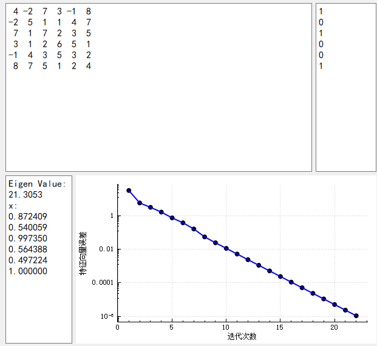
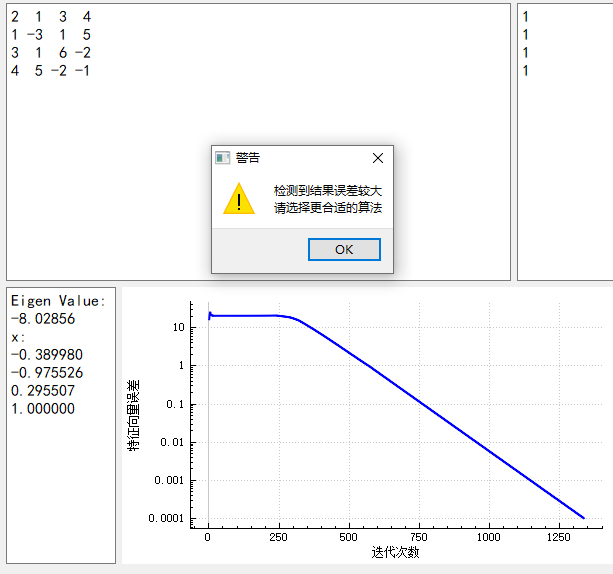
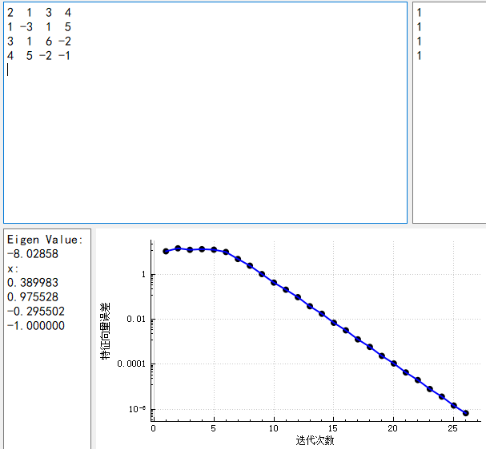

## **华东师范大学计算机科学与技术系上机实践报告**

| 课程名称：数值计算               | 年级：18级        | 上机实践成绩：      |
| -------------------------------- | ----------------- | ------------------- |
| 指导教师：谢瑾奎                 | 姓名：汪杰        | 上机实践日期：12/19 |
| 上机实践名称：矩阵特征值问题计算 | 学号：10185102223 | 上机实践编号：No.5  |

------

### 一、实验目的

1. 求矩阵的部分特征值问题具有重要实际意义，如求矩阵谱半径 $\rho(A)=\max|\lambda|$ ，稳定性问题往往归于求矩阵按模最小特征值
2. 进一步掌握冪法、反冪法及原点平移加速法的程序设计技巧
3. 问题中的题（5），反应了利用原点平移的反冪法可求矩阵的任何特征值及其特征向量。

### 二、使用环境

QT5.15.1，32位编译器

### 三、内容与设计思想

#### 收敛条件

简单收敛条件可以按特征值分布分为下列2种情况：

1.  $\left|\lambda_{1}\right|>\left|\lambda_{2}\right| \geqslant\left|\lambda_{3}\right| \geqslant \cdots \geqslant\left|\lambda_{n}\right|$ 时，当 $k$ 充分大，有 $X^{(k+1)}=A X^{(k)}=\lambda_{1} X^{(k)}$ 。
   - 故此时收敛条件为 $\left\Vert Y^{(k+1)}-Y^{(k)}\right\Vert_\infty<\varepsilon$ 
2.  $\lambda_{1}>0$ ，且 $\lambda_{1}=-\lambda_{2}$ ，即 $\left|\lambda_{1}\right|=\left|\lambda_{2}\right|>\left|\lambda_{3}\right| \geqslant \cdots\left|\lambda_{n}\right|$ 时，当 $k$ 充分大，有 $Y^{(k+1)}=-Y^{(k)}$ 
   - 故此时收敛条件为 $\left\Vert Y^{(k+2)}-Y^{(k)}\right\Vert_\infty<\varepsilon$ 

除了上面两种情况以外，特征值分布还会存在更多复杂情况，这里不予讨论。算法中也只实现了上面两种情况。

因此在判断收敛时，不仅和上一次的计算结果求误差，还要与再前一次的结果求误差。

为了防止死循环（上述两个收敛条件都不满足），在迭代一定次数后会强行退出。

#### 收敛条件（实验指导书）

实验指导书给出的算法中的收敛条件是有问题的。其收敛条件可以表示为 $\left\vert \left\Vert Y^{(k+1)}\right\Vert_\infty-\left\Vert Y^{(k)}\right\Vert_\infty\right\vert<\varepsilon$ 。

这个条件与 $Y^{(k)}$ 收敛大相径庭。

举个简单的反例：对于平面上的旋转阵（例如下面的逆时针旋转90度的矩阵），任意向量在迭代后的无穷范数始终不变，但是迭代不收敛
$$
A=\begin{pmatrix}  
  0 & -1 \\  
  1 & 0  
\end{pmatrix}
$$
实际上，该矩阵不存在实特征值。算法应当告知不收敛。

#### 计算结果自测

对于矩阵 $A$ 给出其特征值 $\lambda$ 与对应的特征向量 $p$ 后，可以通过下式检测该结果是否正确：
$$
Ap=\lambda p
$$
只要等式左右两边的误差不太大，就可以认为计算结果正确。

> 若只给出特征值，是不容易验证其正确性的。

本实验中，以 $\left\Vert Ap-\lambda p\right\Vert_\infty<10\varepsilon$ 作为上述等式的替代条件（浮点误差）。其中 $\varepsilon$ 取收敛条件中的值。

#### 收敛轨迹绘图

收敛总是呈现指数下降的趋势（解线性方程组的迭代法也有相同的规律）。

具体量化来说，设最终的特征向量为 $Y^{*}$ ，那么当 $k$ 充分大，有 $\left\Vert Y^{(k)}-Y^{(*)}\right\Vert_2\propto e^{-k}$ 。

但是，若特征值为负数，那么 $Y^{(k)}$ 是震荡的。因此考虑用迭代向量的差的范数  $\left\Vert Y^{(k+1)}-Y^{(k)}\right\Vert_2\propto e^{-k}$ 来作图。当特征值为负数时，计算  $\left\Vert Y^{(k+1)}-\left(-Y^{(k)}\right)\right\Vert_2$ 即可。

为了更好地展示指数收敛的轨迹，采用对数坐标系。这样，上述图线就会是一条斜率为负数的直线。

### 四、调试过程

1. 特征值计算方式的调试过程：
   - 一开始计算最终特征值是用该式计算的： $\left\Vert Y^{(k+1)}\right\Vert_\infty/\left\Vert Y^{(k)}\right\Vert_\infty$ 。
   - 但是自测结果表明，算法计算有误。（幸亏有自测）
   - 经检查发现，特征值应当为负数，但是输出了正值。显然只通过无穷范数，无法获得特征值的正负，只能获得其绝对值。
   - 因此调整特征值的计算方式：取 $AY^{(k)}$ 的绝对值最大的那个分量，与 $Y^{(k)}$ 的对应分量比较。
2. 对某些矩阵，使用反幂法时，结果为nan。
   - 首先尝试输出每次迭代的向量。发现所有向量都是nan。
   - 猜测是解三角矩阵时出现了问题。在对应函数内调试，发现三角矩阵存在无穷大。
   - 于是检查是否是输入出现了问题，直接输出输入向量，发现是正常的。
   - 最后检查LU分解，发现分解结果存在无穷大。
     - 原因是，LU分解是高斯消元法的直接矩阵表示。但是，高斯消元法时可能会交换某两行，这个操作是无法在LU分解中完成的，否则，LU分解的结果就不是三角阵了。
     - 当然，在现代数值计算引擎（如MATLAB）中，LU分解会自动附带一个置换矩阵P，表示这个交换行为。而不是传统的，只包含L、U矩阵的结果。
     - 我没有实现更加高级的LU分解。
   - 由于没有改进LU分解，因此退而求其次，当LU分解失败时，采用高斯消元法（会带来更高的复杂度）。
     - 判断LU分解失败的条件是，L或U的无穷范数为无穷大。
3. 在不同输入下，观察收敛图像，发现在某些情况下，误差曲线不是收敛到0的，但是在这种情况下确实是收敛的。即图像绘制有误。
   - 具体来说，当存在原点偏移时，某些偏移值会使图像趋于某个非零值，而某些偏移量会让图像正确地趋于0（体现为一条斜率为负的直线）。
   - 分析后认为，在算法内部，原点偏移后，特征值为正，这时的迭代路径是非震荡的，而在叠加上偏移量输出后，特征值变为负数，画图部分认为需要按照震荡的情况处理迭代路径。这就导致的错误。
   - 这个问题不容易修复，需要改动很多代码，包括一些算法核心逻辑，所以我没有修复这个BUG（多数情况下不会遇到，且即使遇到，也只是画图呈现出现问题，算法的计算结果是正确的）。

### 五、实验结果

#### 典型结果

经典的幂法或反幂法的收敛图像如下

可以看出，在对数坐标系下，该图线基本呈直线，说明指数收敛的猜想是正确的。

#### 收敛较慢的结果

对于样例4，在不采用原点平移时，收敛速度是非常缓慢的。原因是，最大和次大特征值的绝对值分别约为 $8.0$ 和 $7.9$ 。比值非常大。

当收敛速度较慢时，虽然算法已经正常退出，即满足 $\left\Vert Y^{(k+1)}-Y^{(k)}\right\Vert_\infty<\varepsilon$ ，但是，随后的自测不通过，即 $\left\Vert Ap-\lambda p\right\Vert_\infty>10\varepsilon$ 。

这就说明 $\left\Vert Y^{(k)}-Y^{(*)}\right\Vert_\infty\neq\left\Vert Y^{(k+1)}-Y^{(k)}\right\Vert_\infty$ 。实际上，由于该样例收敛速度较慢，导致不等式左边远大于不等式右边，才会导致算法虽然收敛，但是精度却没有达到要求。

这种情况下，可以通过原点平移法加速收敛：

经过手动三分，平移量约为 $3\sim4$ 时，只需约 $25$ 次迭代即可收敛，效果显著。

实际上，考虑到其4个特征值分别为 $-8.0,-1.6,5.7,7.9$ （通过MATLAB计算得到），要使按模最大与次大特征值的比值最大，可取平移量 $p=\dfrac{-1.6+7.9}2=3.15$ ，正如上图所示。

另外一个值得注意的点是，该样例的迭代前期和后期的斜率不同，前期基本水平（即误差不变），且存在明显转折点。这个现象我无法解释，希望能有机会了解其中的原因。

#### 通过原点平移法求出所有特征值

样例5的所有特征值分别为 $-6.4,-4.9,0.3$ 

分别设置平移量 $p=0,-7$ ，通过幂法求按模最大特征值，即可分别获得 $-6.4,0.3$ 这两个特征值

设置平移量 $p=-5$ ，通过反幂法求按模最小特征值，即获得 $-4.9$ 这个特征值

### 六、总结

1. 成功实现幂法与反幂法，改进了收敛条件，以正确判别负特征值的情况
2. 简单地讨论了收敛速度，并绘制出图像，验证观点
3. 分析了迭代差值与真实误差之间的关系，并据此解释样例4误差较大的原因
4. LU分解算法有待改进，以适应存在行交换的矩阵
5. 对部分收敛轨迹（指样例4）不能给出令人满意的解释，有待讨论

