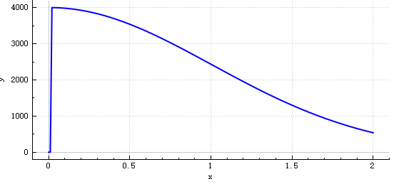
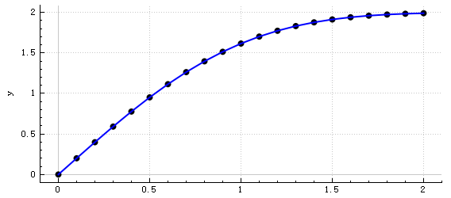

## **华东师范大学计算机科学与技术系上机实践报告**

| 课程名称：数值计算                       | 年级：18级        | 上机实践成绩：      |
| ---------------------------------------- | ----------------- | ------------------- |
| 指导教师：谢瑾奎                         | 姓名：汪杰        | 上机实践日期：12/29 |
| 上机实践名称：常微分方程初值问题数值解法 | 学号：10185102223 | 上机实践编号：No.6  |

------

### 一、实验目的

1. 熟悉各种初值问题的算法，编出算法程序；
2. 明确各种算法的精度与所选步长有密切关系；
3. 通过计算更加了解各种算法的优越性。


### 二、使用环境

QT5.15.1，32位编译器，Windows10操作系统


### 三、内容与设计思想

#### 通用接口设计

该项目应当生成一个通用函数库，以微分方程（组）作为参数，再加上初值、步长等相关参数，输出微分方程数值解的结果。

为了兼容微分方程组，需要将因变量 $y$ 的类型定义为向量，该向量的每一个分量都表示一个因变量。于是，不论是微分方程还是微分方程组，都可以写作一个向量函数（而不必将微分方程组写为多个函数）。函数的参数是标量 $x$ 和向量 $y$ 。

> 各种现代数值计算引擎（如python中的scipy等）都是这样设计的。这里参考了它们的做法。

用STL中的vector作为容器，定义向量：

```c++
typedef double real_type;
typedef std::vector<real_type> ndarray;
```

>  **ndarray** 指 n-dimensional array ，即n维向量。该命名取自python中的numpy。

在此基础上可以定义微分方程（组）的函数类型。该函数的参数在前面已经说明。返回值是每个分量的导数，其维数与输入因变量的维数一致。所以，在用户使用本ODE库时，需要按照此范式定义微分方程组。

```c++
typedef ndarray (*func_t)(real_type, const ndarray&);
```

于是，对于任何一个数值方法，其参数列表形如（省略除了方程组之外的参数）：

```c++
return_t EulerMethod(func_t func, ...);
```

#### 接口应用举例

下面例举一个微分方程组的函数定义：

```c++
ndarray f(real_type x, const ndarray &y) {
    ndarray rst(y.size());
    rst[0] = y[1];
    rst[1] = y[0] / (exp(x) + 1);
    return rst;
}
```

这个函数可以直译为下面的数学表达式：
$$
\begin{cases}
y_0'=y_1\\
y_1'=\dfrac{y_0}{e^x+1}
\end{cases}
$$
实际上，这是一个二阶微分方程 $y''=\dfrac{y}{e^x+1}$ 。

从这里也可以看出，对于高阶微分方程，需要用户手动将其转化为一阶微分方程组，并把函数表示为 $\overrightarrow{y'}=f\left(x,\overrightarrow y\right)$ 的形式。

> 通常，转换高阶微分方程时，建议将y[0]作为原方程中的y，因为后面画图只会绘制y[0]的图像

于是，若要用龙格库塔法求解该微分方程组，就可以像这样调用（略去其余参数）：

```c++
RungeKuttaMethod(f, ...)
```

#### 迭代计算设计

在各种数值方法中，由 $y_n$ 得到 $y_{n+1}$ 的计算过程通常是比较复杂的，而除此之外，就只有一些简单的包装，例如设定初值，判断终止， $x$ 自增 $h$ 等等。于是为了代码的可读性，将 $y_n \rightarrow y_{n+1}$ 的迭代过程封装起来，单独编写。而对于数值计算接口，如 `EulerMethod()` 、 `RungeKuttaMethod()` 等，只负责在循环中不断调用这些迭代函数。

观察发现，虽然函数可以是非线性的，但是迭代过程是线性的，即只涉及向量加减和数乘。

于是，重载运算符，以简化代码。 **ndarray** 本质是 **std::vector** ，这个STL原生不支持上述操作，所以直接定义这些操作。

```c++
ndarray operator+(const ndarray &a1, const ndarray &a2);
ndarray operator-(const ndarray &a1, const ndarray &a2);
ndarray operator*(real_type number, const ndarray &a);
```

有了这些运算符，就能方便地实现迭代计算。下面以最复杂的四阶龙格库塔法为例：

```c++
ndarray RK4Iter(func_t func, real_type x, const ndarray &y, real_type h) {
    ndarray k1 = func(x, y);
    ndarray k2 = func(x + h / 2, y + h / 2 * k1);
    ndarray k3 = func(x + h / 2, y + h / 2 * k2);
    ndarray k4 = func(x + h, y + h * k3);
    return y + h / 6 * (k1 + 2 * k2 + 2 * k3 + k4);
}
```

注意上述代码中各个变量的类型。在定义了 **ndarray** 的各种运算符后，能按照公式直接翻译为代码，而不用关心其他细节。而且这个迭代函数对于方程与方程组都是适用的，代码复用。

#### 动态阶数算法

Runge-Kutta法和显（隐）式Adams法还有一个参数表示阶数。显然，除了迭代函数不同以外，其余代码完全相同。因此，基于迭代函数与函数指针，实现统一的接口。

以Runge-Kutta法为例，下面是接口函数 `RungeKuttaMethod()` 中的部分代码

```c++
auto func_iter = RK2Iter;
if (order == 3) func_iter = RK3Iter;
else if (order == 4) func_iter = RK4Iter;
```

之后再循环中通过函数指针访问对应的迭代函数：

```c++
y = func_iter(func, x, y, h);
```

#### UI界面通用性

显然，上面的函数库已经支持任意ODE作为输入。但是UI界面并不支持，这是因为，函数是静态编译的，你可以在代码中直接将函数写好，让编译器去编译，但是你无法在运行时获得一个新函数的可执行代码。

换言之，UI界面只能提供若干个给定的常微分方程（组），而不具有通用性，无法接收任意的ODE。

在之前的实验中，我已经讨论过这个问题的解决方案，这里复述一下：

1. 自己实现一个能够解析字符串并考虑所有可能情况的函数解释器，相当于实现一个只含有数学函数的编译器，过于复杂。
2. 写一个类似于shell的程序，运行时生成函数代码并编译成可执行文件，然后调用新的可执行文件来计算函数，即调用现有编译器。
3. 如果用python实现，可以用eval()函数。因为python是解释型语言，能够支持运行时的动态语句。

令我很惊讶的是，确实有同学通过方案1实现了运行时的函数解析。但是方案1的问题是：

- 效率降低。每次计算函数都要重新解析一遍，而不是像静态编译那样，直接执行对应代码。
- 扩展性不够强。如果要实现方程组的输入，需要做一定修改，而这可能是比较麻烦的。

当然，没有办法采用方案3，原因是：

- 本项目限定在C++语言中。
- 为什么限定在C++中呢？因为相较于python，C++效率更高。
  - 这里有一个主次关系的问题：本项目的主要目的是提供一个ODE数值计算库，效率是其中最关键的指标。而次要目的是提供一个UI界面，方便使用。
  - 如果为了UI界面的方便，而去牺牲效率，那么是主次颠倒，不可取。

于是，仅存的方案是方案2，且看上去有足够高的普适性。这次实验中，我终于实现了这个方案。

#### 动态编译

具体流程如下：

1. 用户在UI界面中输入符合C++语法的表达式
2. UI界面程序接收该字符串，将其扩展为一份可编译的C++源代码，包含所需要的函数（函数符合前文描述的 `func_t` 范式）
3. UI界面程序创建子进程，令子进程执行编译器程序，编译源代码为动态链接库（ **\*.dll** 文件）
4. UI界面程序链接动态链接库，获取需要的函数指针
5. 随后与静态编译的函数一样，传给数值计算接口函数，完成后续工作

 <u>runtimedll.cpp</u> 实现了对系统调用和 DLL 操作的简单封装，最后在 <u>mainwindow.cpp</u> 中调用已封装的代码，完成功能实现。

下面具体介绍每一步的一些细节：

**第1步**

用户只要输入每个变量的导数对应的表达式，程序会自动填充其余部分，生成完整代码，具体填充规则见第2步。

**第2步**

为了指明这是一个动态链接库函数，需要将函数定义修改为下面的形式：

```c++
__declspec (dllexport) ndarray func(double x, const ndarray &y);
```

填充时，需要写上头文件和函数头。由于用户只输入了等号右边的表达式，所以填充函数体时需要自己补全等号左边。最后补上函数末尾即可。

核心代码如下：

```c++
static const QString header(
    "#include <vector>\n"
    "#include <cmath>\n"
    "using namespace std;\n"
    "typedef vector<double> ndarray;\n"
    "\n"
);
static const QString func_head(
    "__declspec (dllexport) ndarray func(double x, const ndarray &y) {\n"
    "    ndarray rst(y.size());\n"
);
static const QString func_tail(
    "    return rst;\n"
    "}\n"
);
QTextStream out(&file);
out << header << func_head;
for (int i = 0; i < func_code.size(); ++i)
    out << QString("    rst[%1] = ").arg(i) << func_code[i] << ";\n";
out << func_tail;
file.close();
```

**第3步**

首先要知道如何在命令行中编译一个C++源文件：

若要编译为一个正常的exe文件，可以在命令行中执行如下语句：

```powershell
g++ main.cpp -o main
```

若要编译为一个Windows下的 **\*.dll** 文件，可以用如下命令（参考了编译器[官方文档](http://www.mingw.org/wiki/sampledll)）：

```powershell
g++ -c dllmain.cpp
g++ -shared -o dllmain.dll dllmain.o
```

这里只要编译 DLL 文件。

为了在程序内启动另一个程序（类似于命令行），需要用到Windows API **CreateProcess()** 。

编译 DLL 文件的两行命令行对应两次 **CreateProcess()** 。需要检查返回值，从而检测到编译错误。

**第4步**

Windows API **LoadLibrary()** 可以在运行时链接 DLL 。然后在通过 Windows API **GetProcAddress()** 获得 DLL 中的某个函数。这个过程参考了[这篇文章](http://www.codinglabs.net/tutorial_CppRuntimeCodeReload.aspx)。

结合 **FreeLibrary()** 释放 DLL ，就能重新加载 DLL ，从而实现运行时的函数编译和导入。

**如果是Linux...**

在Linux操作系统中:

- 第二步：共享库的代码和普通代码一样，无需修改
- 第三步：系统调用将会是 **fork()** 和 **exec()** ，共享目标文件是 **\*.so** ，而不是 **\*.dll** 。
- 第四步：系统调用是 **dlopen()** 、 **dlsym()** 、 **dlclose()** 

#### 动态编译局限性

运行时编译 DLL 并链接确实能解决大部分问题，但是该方案也存在一定的局限性：

- 要求运行时，环境中存在编译器 g++ ，这一点对于用户不太友好
- 要求函数代码符合C++语法
- 越界访问的错误难以提前检测


### 四、调试过程

#### 有瑕疵的初值

实验指导书问题1的方程是：
$$
\left\{\begin{array}{l}
y^{\prime}=\dfrac{4 x}{y}-x y \\
y(0)=0
\end{array} \quad 0<x \leq 2\right.
$$
其解析解与实验指导书给出的不同。实验指导书给出的解析解为 $y=\sqrt{4+5e^{-x^2}}$ 。显然，初值不满足方程。

我尝试用matlab计算其解析解，结果为
$$
y=\pm\sqrt{4 - 4e^{-x^2}}
$$
至少，该结果满足初值。

此外，实验指导书给出的初值是无法迭代计算的。这个初值会直接导致第一次迭代出现 `nan` 。为了修正这个问题，需要对初值做微小偏移。

我首先尝试了初值 $y(0)=0.0000001$ ，希望以此避免除0问题。但是实验结果存在严重问题。只在 $h$ 非常接近0时，才能正确绘制出函数图像。 $h$ 若偏大，如 $h=0.01$ ，那么函数图像如下（以欧拉法为例）



注意到，前几次迭代让函数值严重偏离正确轨道。而之后的计算结果也都是错误的，因为前几次迭代误差过大。实际上，之后的迭代相当于另一个初值问题 $y(0)=4000$ 的解，与原问题已经无关了（好在这个新的初值问题已经不存在除零错误）。

那么，究竟如何才能获得正确的解呢？初值 $y(0)=0.0000001$ 错误的原因是，解析解不经过该点（在此基础上，累积误差过大）。因此，参照解析解的形式，尝试在函数曲线上找一个初值点。

经过计算可得，上述解析解在0处的导数为2（取正的解析解）。于是考虑如下初值条件：
$$
y(0.0000001)=0.0000002
$$
该点在一阶近似下落在解析解上。因此，即使步长较大，也可以获得较好的效果。



#### 获取DLL函数失败

我在尝试用 **GetProcAddress()** 获取 DLL 中的函数时，发生错误。这部分API的用法参考了[MS开发者文档](https://docs.microsoft.com/en-us/windows/win32/dlls/using-run-time-dynamic-linking)，所以API的使用应该没有问题。

这个函数支持两种获取的方式：

1. 通过函数名（char\*字符串）
2. 通过标识符（内部类型，通过整数指定）

通常只通过方法1获取函数，因为这样的代码可读性和鲁棒性都较高，但是我通过方法1无法获得函数（系统错误号127，即找不到对应过程）。我猜测是编码过程中出了问题，导致函数名乱码。

因此，我只能通过方法2获取函数，代码如下：

```c++
GetProcAddress(hinst, MAKEINTRESOURCEA(1));
```


### 五、总结

1. 设计了通用的常微分方程（组）的数值解算法接口。
2. 实现了各种数值解算法，并尽可能简化代码，提升可读性，提高复用率。
3. 在UI界面中实现了动态编译的功能
4. 动态编译中的越界访问检查还未实现，还不能自带g++工具链


### 六、附录

无

